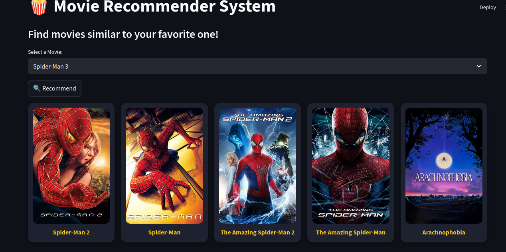

# 🎬 Movie Recommendation System

This project is a simple, interactive **Movie Recommendation System** built using **Streamlit** and **Python**.  
It uses a **content-based filtering approach** to suggest movies similar to the one you select.

The application leverages the **TMDB (The Movie Database) API** to fetch movie posters, providing a visual and engaging user experience.

---

## 🚀 Features
- **Interactive UI**: A user-friendly interface powered by Streamlit.  
- **Real-time Recommendations**: Get instant movie suggestions based on your selection.  
- **Visual Appeal**: Displays movie posters for recommended titles.  
- **Efficient**: Recommendation logic is pre-calculated and stored in a pickle file for fast lookups.  

---

## 🖥️ Demo / Output
Here’s how the app looks in action:  

  
  

